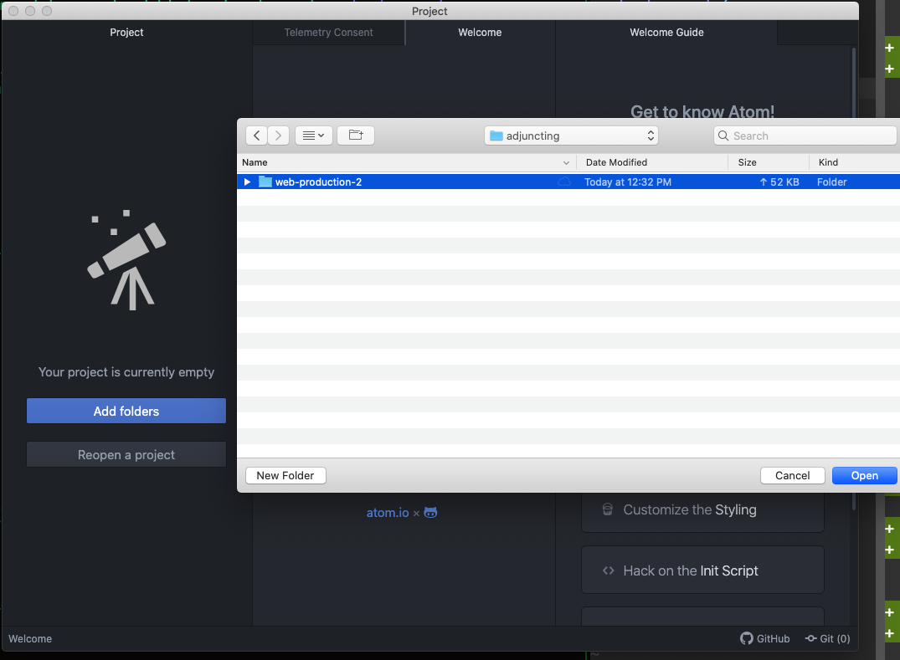
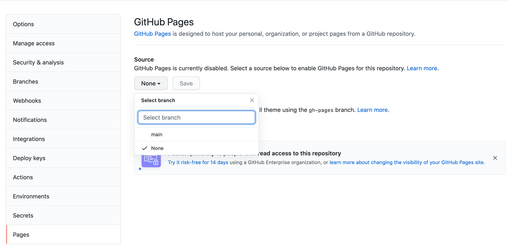
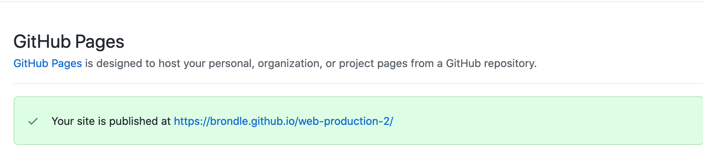

## Setting Up Git And Your Home Directory

### Making The Home Directory

Welcome! Let’s get started by setting up the directory where your work is going to live.
For a quick refresher, the terminal is basically a direct interface to your computer - text-based, rather than the graphical interfaces (like Finder on Mac or File Browser on Windows) that most people use. The terminal is a beautiful thing and learning to use it well will make you an extremely powerful programmer.

Some basic commands to get used to:

`cd`: change directory - enter a folder
`mkdir {directory name}`: make a new folder
`touch {file name}`: make a new file
`ls`: list all files in the current folder

Open the terminal and type `cd Documents`. If you have a preferred folder for classwork, go ahead and `cd` into it for the next step.

Now let’s make a directory for this class: `mkdir web-production-2``

Cd into that folder: `cd web-production-2`

Great! You’ve created the folder where all your work for this course will live.
Now let’s create the basic pages and folders we’ll need this week:

`touch index.html`
`touch script.js`
`touch style.css`
`touch index.html`
`mkdir img`

Now type `open .` and you should see a Finder window with all these files in it.

Check and see if you already have git installed - `git --version`. If you’re on a Mac, it should prompt you to install it if it’s not already there.

Once it’s installed, enter `git init` to create your github repository.

To “save” all our files in git: `git add .`
To “commit” all of them: `git commit -m “my first commit!”`
Finally, let’s rename our primary branch: `git branch -M main` (GitHub, by default, calls its primary branch `master`, which has a [loaded history](https://twitter.com/mislav/status/1270388510684598272))

We’ll mostly be using Git directly from Atom in this course, but it’s useful to familiarize yourself with its CLI (command line interface), especially when you’re working on complicated projects.

(If you run into problems with git, more documentation can be found [here](https://git-scm.com/book/en/v2/Getting-Started-Installing-Git), and, as always, Googling is your friend)

## Getting Set Up With Atom and GitHub

(If you’re an experienced enough programmer that you’re comfortable with git/GitHub and have a preferred text editor, feel free to skip this section)

The first step to becoming an immensely powerful programmer is having a good text editor. For this course, we’ll be using [Atom](https://atom.io/), which is free and beginner-friendly. If you’re more experienced or adventurous, some other popular text editors:

[Sublime](https://www.sublimetext.com/): free but will occasionally show a popup asking you to pay for a license. More powerful than Atom.

[VSCode](https://code.visualstudio.com/): Microsoft’s text editor. I’m not super familiar with it, but plenty of programmers swear by it.

[vim](https://www.vim.org/) and [Emacs](https://www.gnu.org/software/emacs/): Enter at your own peril. These are super-advanced, super-customizable text editors with a high learning curve, for the incurable/insufferable programmer. I use vim but I try not to talk about it.

Go to [Atom’s website](https://atom.io/) and download it.

Now go to [GitHub](https://github.com/) and create an account.

Once you’re done, in Atom hit “Add Folder”, navigate to the folder we created, select it, and hit “Open”

In the GitHub pane, follow the instructions to get a token and log in to GitHub from Atom.

Once you’ve done that, hit “Publish to GitHub” and then “Publish”.

Check your GitHub Repositories, and you should have a brand new “web-production-2” repository!

Let’s get set up to automatically publish our work on GitHub pages for the next few weeks.

In your repo, go to “Settings”, and scroll down the left-hand menu to “Pages”.

Our GitHub page should currently be disabled, so in the dropdown menu select “main” and hit Save.

It’ll take a little while, but if you reload the page in a minute or two you should get a link to your site!

