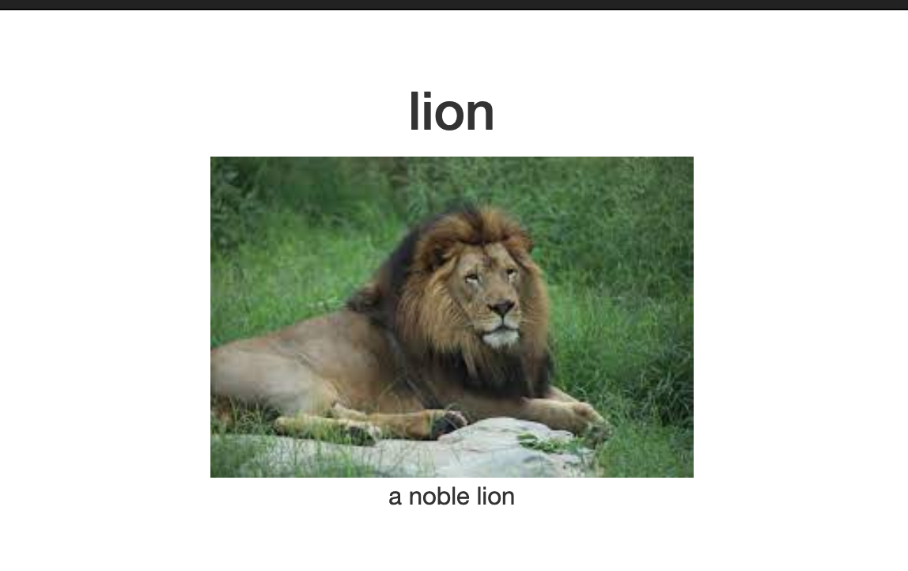

## Zoo Website

A very professional zoo website.

- Your group has been tasked with prototyping a website for a local zoo. Let one person write the code at a time while others take turns giving input - you can swap out after 5 minutes or so.
- In the starter code, `cd` into `exercise-2`, and run `npm install` and `node app.js` - it’ll be running in your browser at `localhost:3000`.
- A list (`animalsList`) of all the animals in the zoo is already being displayed in `home.handlebars`.

- Start by trying to display each animal in the `animalsInfo` variable in line 21 `app.js` on the homepage (`views/home.handlebars`) with its image - it’s already being sent to this page in the ‘/home’ route. You can access its attributes in handlebars by using something like `{{#each animalsInfo}}{{this.name}}</h4>`.

- Once that’s done, add the other animal attributes to the `animal.handlebars` template: this is already partially set up, and you should be able to see the individual animal routes by going to [localhost:3000/animal/0](localhost:3000/animal:0).

- Take a look at how the `/animal` route is working with request parameters - it’s already set up so you can see a basic page for each animal, and has a link to the next animal in the list.

- Try linking to the individual animal pages in the each loop on the homepage
- If there’s time remaining, try adding some JavaScript/jQuery or CSS in the `public` folder to make your page more interactive!
