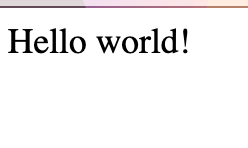
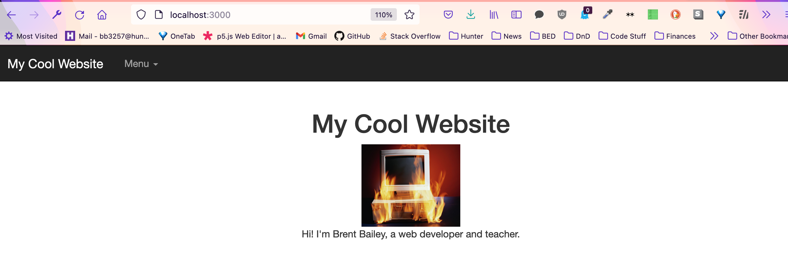

## Getting Started With Node

In the terminal, enter your project folder - if you downloaded it on a mac, this would be:

`cd Downloads/starter-code/`

Run `npm install` to install any pre-existing packages in the folder, and `npm install {package-name}` to add a new package- for example:

`npm install give-me-a-joke`

If you’re using a package in your project, you’ll need to require it at the top of your `app.js` file, e.g.:

`let getJoke = require(‘give-me-a-joke’)`

To run your project, once you’re in the project in the terminal, run `node app.js`. You should be able to see your project by going to `localhost:3000` in the browser.

### Making Changes

If you make changes to anything other than `app.js` - e.g. changing HTML or CSS in the `public` or `views` folders - you should be able to see the changes by refreshing the page.

If you change your server itself, in the `app.js` file, you’ll need to restart it for the changes to work - hit `Ctrl + C` to kill your server, and then run `node app.js` again to restart it.
## Basic Routing And Templating 

Routing is the mechanism for sending the client the content it asks for. For today, this will usually come in the form of a “GET” request: the browser can ask for a page, or an AJAX request can ask for some JSON, and our route will send it back to them. Every time you visit a website, you’re making a “GET” request to its server for that specific page.

Using Express, routing is simple and easy: we set up a “route”, which gets a request and response object, and send it our data. At the most simple level, we can just send it a text string using `res.send`

```
app.get(‘/hello’, function(req, res) {
// req is the request object - we usually don’t need to interact with it.
//res is the “response” object - in this case, we’re just sending the browser some raw text to display
  res.send(‘Hello world!’)
})
```

If we open our “hello” route in the browser, at `localhost:300/hello`, we should see this:




### Templating And Folder Structure

In our project, you should see this code block:

```
// set up templating engine
var handlebars = require('express-handlebars').create({
    defaultLayout:'main'
});
app.engine('handlebars', handlebars.engine);
app.set('view engine', 'handlebars');

// run our app on port 3000
app.set('port', process.env.PORT || 3000);

//allow server to use files in the public folder
app.use(express.static(__dirname + '/public'));

```


This does two things: sets up a templating engine (handlebars), and tells our app to serve “static” files from the public folder: this allows us to access images, javascript, and CSS in that folder on the front-end. You don’t really need to worry about how these lines work, as long as you make sure to have them in your project.

Once our project is set up to use Handlebars and our static folder, we can do a lot of powerful stuff - Handlebars allows us to render our HTML on the server side, which gives us a lot of power over what’s shown on different pages and can save us a lot of trouble writing the same HTML over and over.

### Anatomy of Our Handlebars Folder

Handlebars renders dynamic HTML from the `views` folder.

**layouts**: Found in `views/layouts`, these are handlebars templates that can be reused across pages. In ours, you should see `main.handlebars`, which is the default layout used across pages: we can use this to not have to rewrite our <head></head> tags, and just reuse the same content across all our pages that needs it. In our case, our layout template contains jQuery, bootstrap, our page title, and some other fun stuff that will now by default be displayed on every page.

Inside a layouts template, you’ll see a tag that just says `{{{ body }}}`: by putting this in the layout tag, it’ll render the HTML we put in our template files by default.

**views**: files inside the `views` folder are Handlebars templates for individual pages. You can just write pure HTML in these, and they’ll be wrapped in our layout template and served to the browser. You can also include templates and variables inside Handlebars templates, which we’ll get to in a little bit. These should always end in `.handlebars`, like `home.handlebars` or `about.handlebars` 

**partials**: Found in `views/partials`, partials folder contains handlebars templates that we want to reuse across different pages. For example, we use our `nav.handlebars` partial in `layout.handlebars` so the same navbar is shown across every page. You can call a partial in another handlebars file by using the `{{ > my-partial}}` notation, so say you had a partial with some text about you:

**partials/about-me.handlebars**
```
<p> I’m Brent Bailey, a web developer and teacher!</p>
```

We could reference this in any of our handlebars templates by including it as:
```
{{> about-me }}
```


### Serving a Handlebars Template

To tell our server to send a Handlebars template to the front-end, we just use `res.render` instead of `res.send` - so if we want to send a template, `home.handlebars`, at the root of our set, we just set up the template in `views/home.handlebars`:

**home.handlebars**
```
 <div class="container text-center">
  <h1>My Cool Website</h1>
  {{! we can add comments in our handlebars notation like so }}
{{! and, since we set our app up to use the "public" folder we can reference an image in that folder from our handlebars template  }} 
<div class="header-image"></div>
  {{> about-me }}
</div>
```
 
Then, in `app.js`, we render the template when the browser asks for the `/` route:

```
app.get('/', function(req, res) {
  res.render('home')
});
```

And if all goes well, when we open localhost:3000, we’ll see our homepage:



