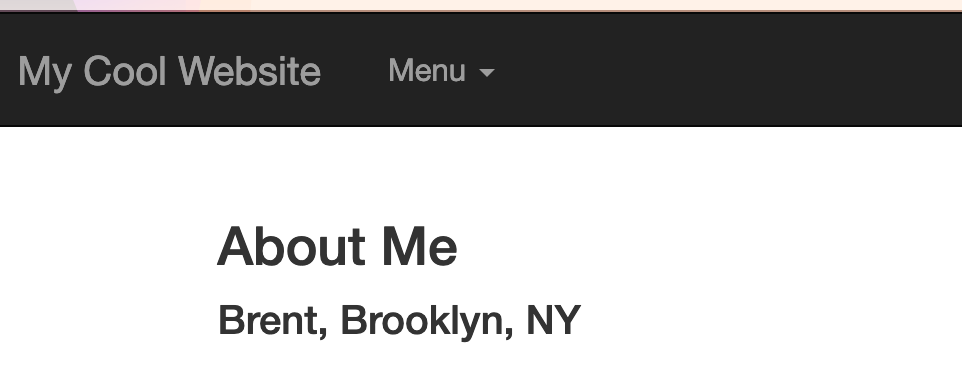
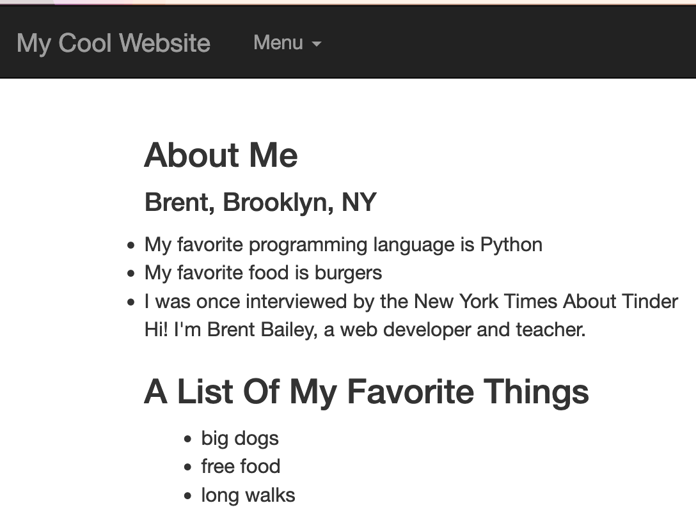
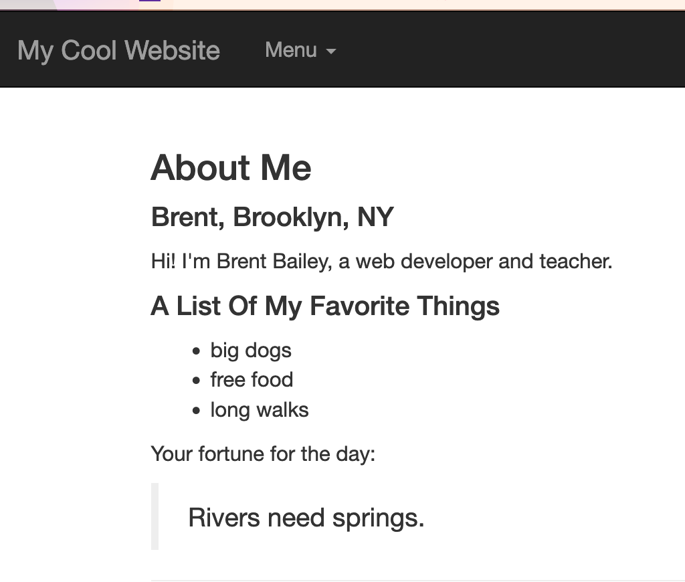

## Passing Data From The Server To A Template

Templates get really powerful when we pass data to them from our server. Once you incorporate a database, you can pass massive amounts of data to templates - think the thousands of product pages on eBay. Those are all data passed from a server to a template - saves a lot of time on writing HTML!

### Passing A Simple Object

We can pass a JavaScript object from a server to a template pretty easily, and then use Handlebars’ object notation to display that object in our HTML:

**app.js**
```
let me = {'name': 'Brent', 'location': 'Brooklyn, NY'}
app.get('/about', function(req,res){
	res.render('about', {
    person: me
  });
});
```

**about.handlebars**
```
<h3>About Me</h3>
<h4>{{ person.name }}, {{ person.location }}</h4>
```

Which should display:



### Iterating Over Lists

We can also pass a list, or list of objects, to handlebars, and iterate over it. We just declare a normal JavaScript array, and use Handlebars’ #each notation:

```
{{# each object}}
  {{this}}
{{/each}}
```
For example: 
**app.js**:
```
let moreInfo = ['My favorite programming language is Python', 'My favorite food is burgers', "I was once interviewed by the New York Times About Tinder"]

app.get('/about', function(req,res){
	res.render('about', {
    person: me,
    moreInfo: moreInfo
  });
});
```

**about.handlebars**
```
<h3>About Me</h3>
<h4>{{ person.name }}, {{ person.location }}</h4>

{{#each moreInfo }}
<li>{{ this }}</li>
{{/each}}

{{> about-me }}
```

### Passing An Object To A Partial
Unfortunately, since we don’t render partials in our routes, we can’t pass variables directly to them from the server. We can get around this by using something called middleware. Say we wanted a partial that contains a list of our favorite things, declared in the variable `listOfThings`:

**app.js**
```
let listOfThings = { things: [{adjective: 'big', noun: 'dogs'}, {adjective: 'free', noun: 'food'}, {adjective: 'long', noun: 'walks'} ]}


app.use(function(req, res, next){
	if(!res.locals.partials) res.locals.partials = {};
 	res.locals.partials.favoriteThings = listOfThings;
 	next();
});
```

Again, all you should ever need to do with this is modify it, but what this is doing is this: if the partial is asking for a variable called favorite things, it passes it our variable “list of things”. So now we can make a partial, `partials/things.handlebars`, and it’ll automatically be passed our list of things variable:

**partials/things.handlebars**
```
<h4> A List Of My Favorite Things </h4>
<ul>
{{#each partials.favoriteThings.things}}
<li>{{adjective}} {{noun}}</li>
{{/each}}
</ul>
```


We can add that partial to our about page:

**about.handlebars**
```
<h3>About Me</h3>
<h4>{{ person.name }}, {{ person.location }}</h4>

{{#each moreInfo }}
<li>{{ this }}</li>
{{/each}}

{{> about-me }}

{{> things }}
```

And we should get something like this:



### Using Templates With jQuery On The Front-End

If you want to get more complex or dynamic, you can also compile jQuery templates on the front-end. This can get a little tricky, but allow you to do really interesting things with your templates. Say we want to generate a nursery rhyme with data from our server. We can create a Handlebars template by putting it in a script tag, and **making sure to put a backslash `\`** before our dynamic variables - this ensures that the server doesn’t compile the variables while it’s rendering the template.

First, we want to set our server up to render a rhyme template, and send JSON data to an AJAX request - we can do this simply by creating a regular `res.render` endpoint for our template, and a separate endpoint that uses `res.json` to send JSON to our AJAX request:

```
app.get('/rhyme', function(req, res){
	res.render('rhyme');
});

// create a nursery rhyme object
let nurseryRhymeObject = [{animal: 'squirrel', bodyPart: 'tail',adjective: 'bushy', noun: 'heck'}, { animal: 'dragon', bodyPart: 'wings', adjective: 'scaly', noun: 'snakes'}, {animal: 'codfish', bodyPart: 'gill', adjective: 'striated', noun: 'i dunno gills'}]

// send our AJAX request a random nursery rhyme
app.get('/data/rhyme', function(req, res){
	res.json(getRandomItem(nurseryRhymeObject));
});

function getRandomItem(array) {
  let idx = Math.floor(Math.random() * array.length);
	return array[idx];
}
```

We can then create a template for an AJAX poem in handlebars like so - again, remembering to put a backslash before each handlebars variable:

**rhyme.handlebars**:
```
<script id="nurseryRhymeTemplate" type="text/x-handlebars-template">
		Mary had a little <b>\{{animal}}</b>, its <b>\{{bodyPart}}</b>
		was <b>\{{adjective}}</b> as <b>\{{noun}}</b>.
	</script>

<div id="nurseryRhyme">Click a button....</div>
<hr>
<button id="btnNurseryRhymeAjax">Generate nursery rhyme from AJAX</button>
<script src="js/rhyme.js"></script>
```

In our public folder (so our front-end can access the script), we can use jQuery and AJAX to make a request to the server. We have to tell Handlebars’ front-end script, which is included in the `<head></head>` tag in `layout/main`, to compile our template, and then we can pass it the data from our AJAX request.
```
		$(document).ready(function(){

			var nurseryRhymeTemplate = Handlebars.compile(
				$('#nurseryRhymeTemplate').html());

			var $nurseryRhyme = $('#nurseryRhyme');

			$('#btnNurseryRhymeAjax').on('click', function(evt){
				evt.preventDefault();
				$.ajax('/data/rhyme', {
					success: function(data){
            console.log('data: ', data)
						$nurseryRhyme.html(nurseryRhymeTemplate(data))
					}
				});
			});

		});
```
If we did everything correctly, we’ll have a little poem generator!


### Creating Your Own Module

In addition to using `npm install` for modules, we can create our own in the `lib` folder. Say I wrote a little function to generate a random fortune, in `lib/fortune.js`:

**lib/fortune.js**:
```
let fortunes = [
	"Conquer your fears or they will conquer you.",
	"Rivers need springs.",
	"Do not fear what you don't know.",
	"You will have a pleasant surprise.",
	"Whenever possible, keep it simple.",
];

exports.getFortune = function() {
	let idx = Math.floor(Math.random() * fortunes.length);
	return fortunes[idx];
};
```

By declaring this as exports.getFortune, instead of our regular way of declaring functions, I’m telling node that this function is an “export” for my module, which allows me to call it in the server. So if I want to add a little fortune to my about page, in `app.js`, I can now import my module:

```
let fortune = require('./lib/fortune.js');
```

And call its getFortune function to pass a value to my about page:
```
let me = {'name': 'Brent', 'location': 'Brooklyn, NY'}
app.get('/about', function(req,res){
	res.render('about', {
    person: me,
    fortune: fortune.getFortune()
  });
});
```

Now, I just add that `{{ fortune }}` object to my about page:

**about.handlebars**:
```
<h3>About Me</h3>
<h4>{{ person.name }}, {{ person.location }}</h4>
{{> about-me }}

{{> things }}

<p>Your fortune for the day:</p>
<blockquote>{{fortune}}</blockquote>
```

And if all went well, I should see something like this:




