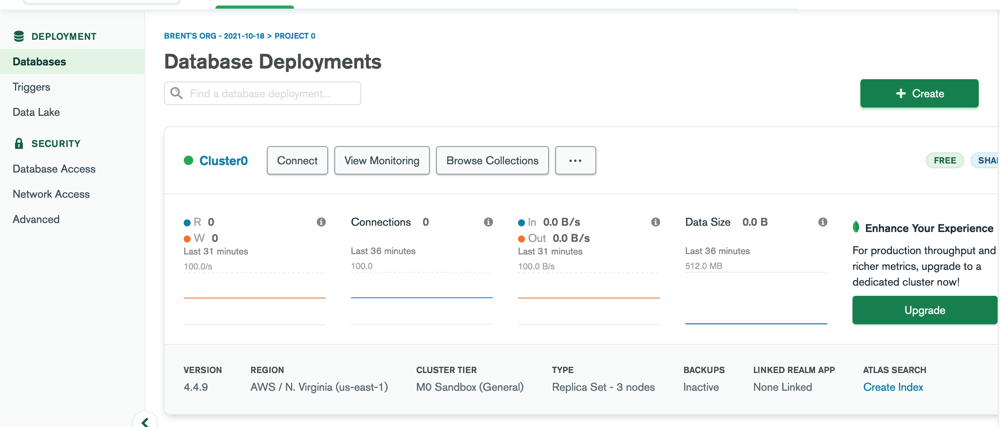
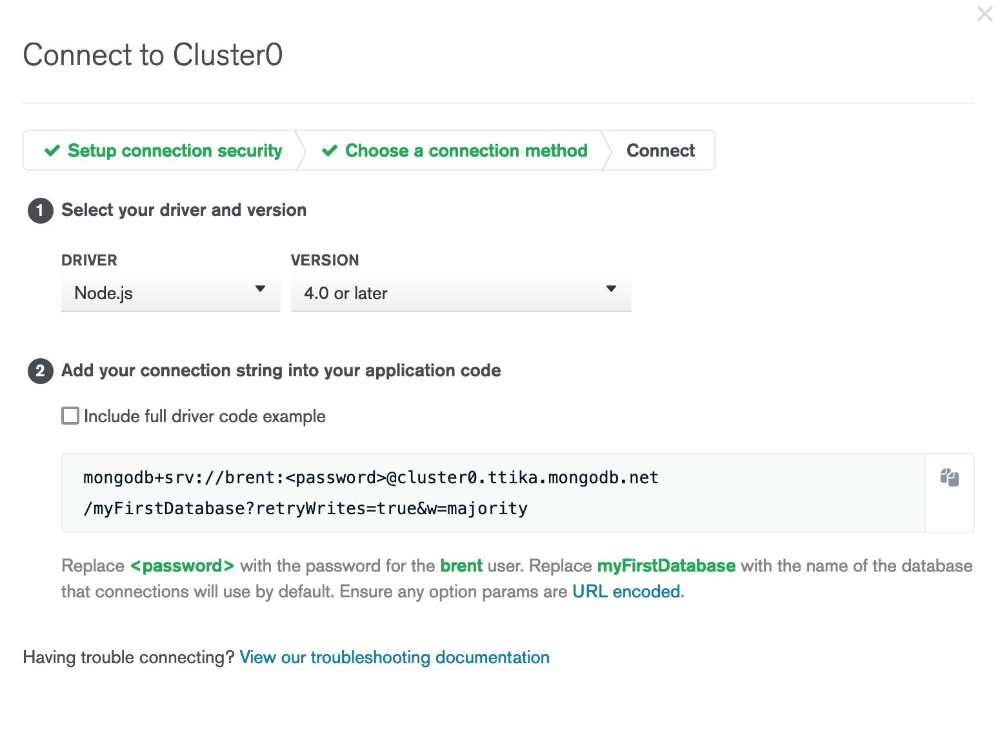
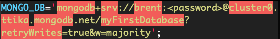

## Setup

This is another one of those things that might take a little while and be annoying, so be prepared. If you get lost, you can follow the instructions [here](https://www.mongodb.com/developer/how-to/use-atlas-on-heroku/) as well.

If you haven’t already, download the [Heroku CLI](https://devcenter.heroku.com/articles/heroku-cli).

Register for [MongoDB Atlas](https://www.mongodb.com/cloud/atlas/register) and create a new project - just create a free cluster, you shouldn’t need to pay for anything more right now.

Create a database user: navigate to the “Database Access” section in the bar on the left-hand side and click “Create a new database user”. Select “password” authentication - make sure to save this password somewhere useful, you’ll need it in a little bit.

Go to the “Network Access” tab in the sidebar, hit “Add IP Address”, and hit “Allow Access From Anywhere”:

Navigate back to the MongoDB project dashboard, hit “Connect”, and add “allow access from anywhere”.

In “choose a connection method”, hit “connect your application”. 

Hit “Next” and copy this connection string and paste it into a text editor:  replace the `<password` with the database user you created earlier. You can also change `myFirstDatabase` to whatever you want to call your database - every time you change this string and run your app, you can create a new database, which can be useful for debugging.

Download the [starter code](https://drive.google.com/file/d/1wNhrYFywMnCWRBrf2x2MZ3iH3s_-hcu2/view?usp=sharing) and `cd` into the `message-board` folder inside it. Copy the connection string and add your password that you created for your database user, and put them in the `.env` file in the starter code.

## Setting Up Your Database On Heroku

Make sure you’ve created a git repository and commit to it in Atom.

`cd` into your project in the terminal and enter `heroku create`

Then in the terminal, enter `heroku config:set MONGODB="{the connection string}"` - this should be the same connection string that you added to your `.env` file.

Finally, in the terminal, enter `git push heroku master` (or `git push heroku main`) to push it to heroku, and `heroku open` to see if it deployed properly.
