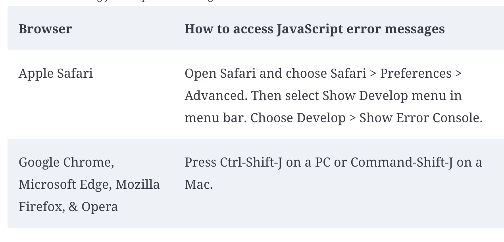

### Class 2 - Drawing With Code

## A Quick Reminder: Debugging JavaScript Code

If you’re having issues with your JavaScript code, the easiest way to debug is by checking your browser console:



You can also use `console.log()` to display a JavaScript variable in the console that’s giving you trouble:

```
let myProblemVariable = ‘I’m a problem’;
console.log(myProblemVariable);
```


## Setup


For today’s session you’ll probably want to create an account in the [p5.js editor](https://editor.p5js.org/)

Download the [in-class starter code](https://drive.google.com/file/d/1yEB4dZjnPzzPV_WED1KxrWVZeFntZI3d/view?usp=sharing)


### CSS Transitions & Animation

There are more complicated ways of drawing with code using JavaScript, but we can do plenty with good old-fashioned CSS.


### The Canvas

The canvas is a curious case in HTML5. It’s technically an HTML tag, and can have its width/height/other attributes modified a bit with CSS, but to actually draw on a canvas you have to use JavaScript.

We won’t touch the canvas directly much, since p5 is an easier way of working with it, but some basics are here:

[Canvas tutorial](https://developer.mozilla.org/en-US/docs/Web/API/Canvas_API/Tutorial)

### p5.js

[p5](https://p5js.org/) is a library that lets us interact with the canvas in more intuitive and simple ways.

The starter code for a local p5 sketch is in this week’s starter files, but you can also create an account with the [p5 editor](https://editor.p5js.org/) if you want to play with your code without having to constantly reload the page.

[p5 Reference](https://p5js.org/reference/)

### Reference
- [p5 Cheatsheet](https://bmoren.github.io/p5js-cheat-sheet/)
- [p5 Examples](https://p5js.org/examples/)
- [p5 Reference](https://p5js.org/reference/)


### Inspiration
- [Experiments with p5](https://purin.co/Experiments-with-P5-js)
- [77 CSS Animation Examples](https://freefrontend.com/css-animation-examples/)
- [Creative Coding with p5](https://www.codecademy.com/resources/blog/creative-coding-p5js-examples/)
- [p5 Showcase](https://showcase.p5js.org/#/2020-All)


### Reading

- [Advanced HTML & CSS: Transforms](https://learn.shayhowe.com/advanced-html-css/css-transforms/)
- [Advanced HTML & CSS: Transitions & Animation](https://learn.shayhowe.com/advanced-html-css/transitions-animations/)
- [Get Started With p5](https://p5js.org/get-started/)
- [Introduction to p5](https://medium.com/comsystoreply/introduction-to-p5-js-9a7da09f20aa)


### Assignment 2

- [Starter Code](https://drive.google.com/file/d/1OHcE8Zcm9OIs-xMjun9Tc8oPSnsLjNaW/view?usp=sharing)
- Make your own iteration on one of the p5 sketches from class: self-portrait, abstract art. You’re welcome to use the assignment starter code or the code from class as a jumping off point, but you should add at least 3 new shapes or lines and show evidence of exploring with color, position, etc.
- Or roll your own drawing! If you’re a more experienced JavaScript programmer, consider adding animation or movement.
- If you decided to work in the p5 editor, don’t forget to hit `File > Download`, and add a `<link rel=”stylesheet” href=”styles.css”`> to your “index.html” for the next step.
- In the `index.html` file for your p5 sketch, add an HTML element with at least one CSS animation or transition from class.
- In your web production 2 folder, create a folder called `week2`
- Put your finished code in the `week2` folder and commit and push to GitHub
- Check and make sure it uploaded to your GitHub page - it should be at {your github username}.github.io/week1/
- Submit the link [here](https://docs.google.com/forms/d/e/1FAIpQLScJ_hzjToD08UX5Py2QP4t8VhiKaIAHZNn6dQVUQbSerfHgrA/viewform?usp=sf_link)

