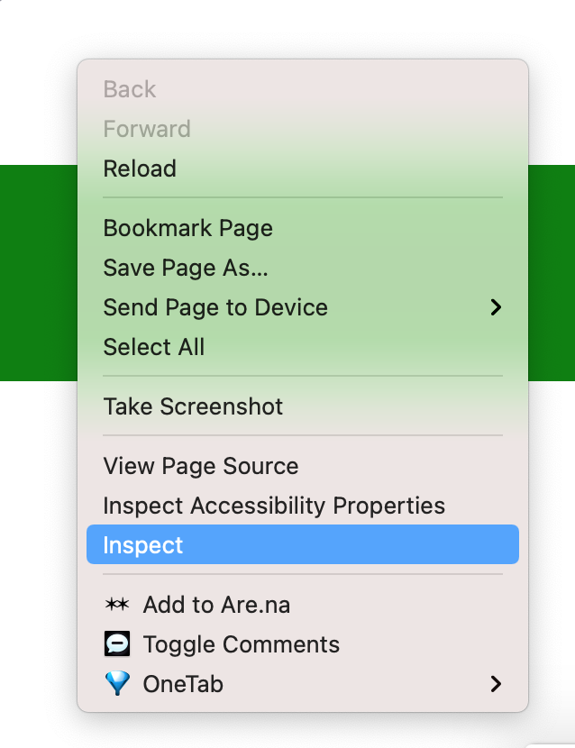
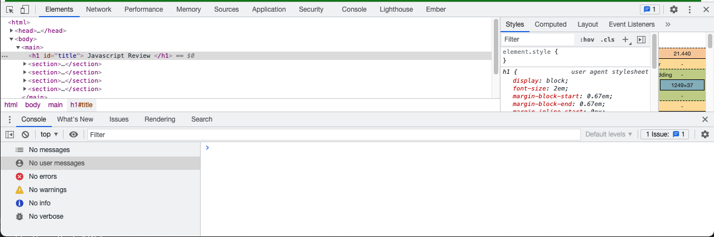

## JavaScript Review 2.0

Today we’re going to take a deeper dive into JavaScript, and talk about some basic tools of the trade when writing JavaScript on the front-end.

### Setup

Download the starter code and open `index.html` in the browser:

Open the browser console: right click on the window and hit inspect:



You should see a window like this, which is incredibly useful: the top section allows you to inspect the HTML, and will show you the CSS rules applied to it, and the bottom section is the JavaScript console, which `console.log()` statements print to and where any errors with your JavaScript will appear.
 



### The Power of JavaScript
JavaScript is the primary programming language that allows us to interact directly with HTML. Every time something moves dynamically on a page, or a new element appears, that’s usually JavaScript (although it can be done with some of the CSS tricks we went over last session).

#### Making a script

The simplest way to call a JavaScript script is just to put it directly in the HTML.

We can call a simple function from a button:
`<button onclick=”console.log(‘wassup’)`

And in the console, if we click the button, we should see it say “wassup”.


We can also call a script directly in the HTML:

```
<body>
  <script>
    console.log(‘i’m in the HTML’);
  </script>
</body>
```

This isn’t generally considered a best practice, though. Especially on HTML pages that are already complicated, it’s nice to keep our JavaScript in a separate file, and try to organize and comment that code as best we can so we (or other people) know what it’s doing.

We can call these external scripts using a script tag too, just using its `src attribute`:
**HTML**:
```
<body>
  <script src=’script.js></script>
</body>
```
**JS:**
```
console.log(‘I’m coming from a script!’)
```

We can also pull a script from an external website, like the p5.js library we used last session:

The simplest way to start interacting with HTML is using `document.write`, which just writes text directly to the document, e.g: `document.write(‘<p>hello!</p<>)`, which. This is, generally speaking, not the best idea, though.


##### Order of execution

JavaScript scripts, unless we tell them to otherwise, run immediately once they’re loaded. So, if we add a `document.write()` to our starter code, they just immediately write to the page, which is fine for our purposes - they’re running immediately on the page load,and then all the HTML is added. But if we make a button that runs a `document.write()`, after everything has loaded, it rewrites the page! 

Some other notes about scripts:

JavaScript scripts are executed in the order that they appear in the HTML. So if we have a script full of functions that we want to reference later - like the p5.js library from the last session - we put it in the `<head></head>` of our HTML.

If we have a script that’s directly making changes to the HTML/DOM, we put it at the bottom of our document `<body></body>` - this way we can be sure the HTML has loaded before we try to change it.

#### Interacting With HTML

So if we’re not supposed to use document.write, how do we interact with the DOM?

Usually, we either use `document.getElementById()` or `document.querySelector()`.

`document.getElementById()`, as you can probably guess, gets an element by its ID, which is why we always want to only have one element with a certain ID.

Once we get the element, we can change any of its attributes with JavaScript! We can change the title of the page:

`document.getElementById(‘title’).innerText = ‘JavaScript Rules!`

`document.querySelector()` gets the first element that matches the “query” it’s being given, which can be a class, a type of HTML element, an id, or lots of other stuff.  [Reference here](https://developer.mozilla.org/en-US/docs/Web/API/Document/querySelector)

So we can get the first `<p>` element and change its text like so:

`document.querySelector(‘p’).innerText = ‘i’m changing my text!’`

But we can also do a whole lot more, like changing the style or adding HTML elements - let’s try on the `<p>` element with class ‘.change-html’:

`document.querySelector(‘.change-html’).innerHTML = <strong>I HAVE A LOT TO SAY</strong>`

**A note**: `.innerText` writes whatever you put as plain text, instead of HTML, while innerHTML writes actual HTML to the element, allowing us to write that `<strong></strong>`

We can also use JavaScript to change any styles we would set in CSS:
`document.getElementById(‘title’).style.color = ‘pink’`

If you wanted to get an array of all the elements that match a selector, you could use `document.querySelectorAll` or `document.getElementsByClassName` - we’ll get more into what you can do with these next week when we work with arrays and for loops.

[More on selectors](https://developer.mozilla.org/en-US/docs/Web/API/Document_object_model/Locating_DOM_elements_using_selectors)


### Variables

There are three ways to declare variables in JavaScript, `var`, `let`, and `const`. For our purposes, we usually just want to use `let` or `const` - there are some complicated differences you can read more about [here](https://www.freecodecamp.org/news/var-let-and-const-whats-the-difference/):

Let initializes the variable, but also allows you to reassign the variable - you should only use `let` once, when you’re creating the variable itself:
```
  let myColor = ‘green’
  console.log(‘my Color:’, myColor )
  myColor = ‘red’
  console.log(‘my Color:’, myColor)
```

A constant can only be assigned once, and if you try to reassign it you’ll get an error:
```
  const myConstantColor = ‘red’
  console.log(‘my constant: ‘, myConstantColor)
  myConstantColor = ‘green’
```


JavaScript variables can hold multiple types of values - we’ll talk more about arrays and objects next week, but for now we’ll focus on strings `”which are basically words or sentences”` - and integers (numbers without floating points).

#### Global and local scope

One other thing to note is that JavaScript variables behave differently inside and outside of functions. If we declare a variable outside of a function, it’s a “global” variable, and everything in our script has access to it. If we declare it inside a function, only the function has access to it. It’s important not to redeclare a global variable inside a function if that function is supposed to be using or changing it!
```
let myGlobalVariable = ‘hello’
function logGlobalVariable() {
  console.log(‘global variable inside the function: ’, myGlobalVariable)
}
console.log(‘global variable  outside the function: ‘, myGlobalVariable())

function redeclareGlobalVariable() {
  let myGlobalVariable = ‘goodbye’
  console.log(‘global variable inside the function:’ , myGlobalVariable)
}
console.log(‘global variable outside the function: ‘, myGlobalVariable)
```

### Functions

Functions allow us to write reusable blocks of code that we can call either directly in the script or based on events in the DOM, like, say, a button click.

Calling from a button click:
**HTML**: 
```
   <button onclick="sayWhassup()">say whassup</button>
**JavaScript**:
```
  function sayWhassup() {
    console.log(‘whassup’)
  }
```

Or call them directly from our script using the `()`:

```
  function sayYo() {
    console.log(‘yoooo’)
  }
  sayYo()
```
They can also take arguments and do things with them:

```
  function sayTheLine(word)) {
    console.log(word)
  }
```

Or return something, which can be useful for setting or changing a variable:

```
let welcome = ‘welcome to javascript’

function addToString(string) {
  return string += ‘, my good friend!’
}

welcome = addToString(welcome)
console.log(welcome)
```

But functions get really powerful when we use them to:
- Shorten long bits of code
- Interact with the HTML 

You can find some of these in the utility.js file - for example, the O(element) function, which gets an element:
```
function O(i)
{
  return typeof i == 'object' ? i : document.getElementById(i)
}
```

Note that this function “returns” something, in this case an HTML element, so we can access it more quickly by setting a variable:

`let myElement = O(‘element’)`

and the S() function, which can take the result of an O() object and allow you to change its style quickly:

```
function S(i)
{
  return O(i).style
}
```

So we can add a function that changes the background color of a div and write a lot less:
```
  let divChangeColor = ‘blue’
  function changeColor(element) {
      S(element).backgroundColor = color
  }
```
  So we want to pass this element we get with the `O()` function and change its background color to a global color variable. But, since we want to pass this function an element that we’re getting from the script, we can’t just use a button, we have to use an onclick listener, another JavaScript trick:
```  
let changeDiv = O(‘change-me’)
changeDiv.onclick = function() {
  changeColor(changeDiv)
}
```
This listens for a click on the element and then runs the function.

Or, we can make it really interactive by using a form and getting the input:

```
function getAndChangeColor() {
  let valueElement = O("set-color")
	let colorDiv = O("change-me")
  // get value of input element and change our global color variable
  let divChangeColor = valueElement.value

	changeColor(colorDiv)
	// clear input element
	valueElement.value = ''
}

let changeButton = O('change-color')
changeButton.onclick = function() {
	getAndChangeColor()
}
```

### Operators and Outputs

Open the operators and outputs file in the starter code - we’re going to use simple math to make an extremely unnecessary media player, we just need to add our operators:

- `=`: sets a variable equal to something - we can set our global total variable to 0 for now: `let total = 0`
- `+=`: adds to a variable - so in our adding function, we can add to our total - we can use `total = total + value`, or the shorthand, `+=`
- `-=`: subtracts from a variable
- `*=`: multiplies a variable
- `/=`: divides a variable

There’s also the [modulus operator](https://developer.mozilla.org/en-US/docs/Web/JavaScript/Reference/Operators/Remainder), which you shouldn’t have much reason to use:
- `%=`: This gives us the remainder when one variable is divided by another: `12 % 5` would equal 7


We can also add numbers to strings and vice versa, but this can get pretty weird: 

```
let n = “123`
n*=1
```

```
n = 123
n+= “”
```

JavaScript has some built-in functions that make dealing with numbers that should be strings and vice versa easier:

```
let n = “123”
n = parseInt(n) // this will convert N into an integer or whole number - 123
n = parseFloat(n) // this will convert N into a floating point number - 123.0000
n = Number(n) // this tries to parse the whole string, which can lead to problems
```


You can also turn a number into a string like so:

```
let n = 123
n = parseString(“123”)
```

You’ll notice we’re using `parseInt` in the calculator example - even though our input element is designated as a number, it still comes out as a string in the JavaScript!

More on number conversion [here](https://thisthat.dev/number-constructor-vs-parse-int/).

### Conditionals

Open the `conditionals` folder in today’s starter code. We’re going to be looking at some ways of doing control flow by writing a really simple fortune generator.


We can use an `if` statement and comparison operators to make a definitely true statement:

```
  if (name == ‘Brent’) {
    fortuneString += ‘ be a professor’
  }
```

and add an else to make another one:
```
  if (name == ‘Brent’) {
    fortuneString += ‘be a professor’
  } else {
    fortuneString += ‘be a student’
  }
```

We can also make an else if statement based on the number we select, and use comparison operators to make different fortunes:

```
  if (num >= 2) {
    fortuneString += ' find true love'
  } else if (num > 0) {i
    fortuneString += ' win great riches'
  } else {
    fortuneString += ' become a pauper' //shouldn’t have picked zero!
  }
```

Or use a switch case, which takes a variable and behaves differently based on what its value is:
```
switch (num) {
    case 1:
      fortuneString += ', and develop superpowers'
      break; //this ends execution for this case - if other cases are true and you don't include a break statement, they can get executed too
    case 2:
      fortuneString += ', and end up marooned at sea'
      break;
  }
```

Finally, we can use logical operators in case we want to see if two things are true (`&&`), either of two things are true (`||`), or something isn’t the case:


```
if (name == “Brent” && num == 3) {
 fortuneString += ‘ and write a lot of code this week’
}

```


## Reading & Assignment
### Reference
- [A list of every style attribute you can change with JavaScript](https://www.w3schools.com/jsref/dom_obj_style.asp)
[HTML Media Player API](https://developer.mozilla.org/en-US/docs/Web/API/HTMLMediaElement)
### Reading
- [Getting Started With JavaScript](https://developer.mozilla.org/en-US/docs/Learn/Getting_started_with_the_web/JavaScript_basics)
- [Making decisions in your code](https://developer.mozilla.org/en-US/docs/Learn/JavaScript/Building_blocks/conditionals)
- [Functions -- reusable blocks of code](https://developer.mozilla.org/en-US/docs/Learn/JavaScript/Building_blocks/Functions)
- [Function return values](https://developer.mozilla.org/en-US/docs/Learn/JavaScript/Building_blocks/Return_values)
- [Introduction to events](https://developer.mozilla.org/en-US/docs/Learn/JavaScript/Building_blocks/Events)

### Assignment
You have two options this week, either:
#### Option 1 - Media Player
- Style at least two elements on the page using only JavaScript - no CSS this week!
- Add at least two buttons or inputs to the UI that do something to the page or the media player with JavaScript - change its size, styling, add an element - the crazier the better!
- Add at least two more options to the switch statement to pick videos - there are more videos in the videos folder, but you can also download your own (just make sure to keep them short, GitHub gets mad about upload limits) 
- If you’re comfortable with the command line, [youtube-dl](https://ytdl-org.github.io/youtube-dl/index.html) is a great tool for downloading videos, my usual command is `youtube-dl '{youtube link here}' -f 'bestvideo[ext=mp4]+bestaudio[ext=m4a]/best[ext=mp4]/best'`

#### Option 2 - Fortune Teller
- Add a new input (it can be a select, text input, number, or anything else) and use its value in an if/else, switch statement, or function to add to the fortune
- Style at least two elements on the page using JavaScript - no CSS this week!
- Add at least two buttons that style an element or add something to the page using JavaScript
- Add at least two more options to the switch statement
