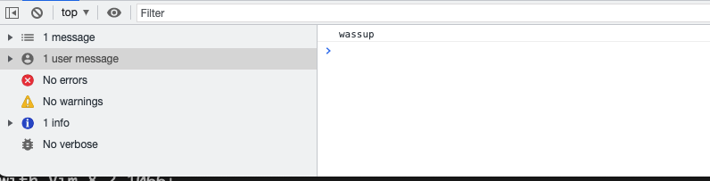
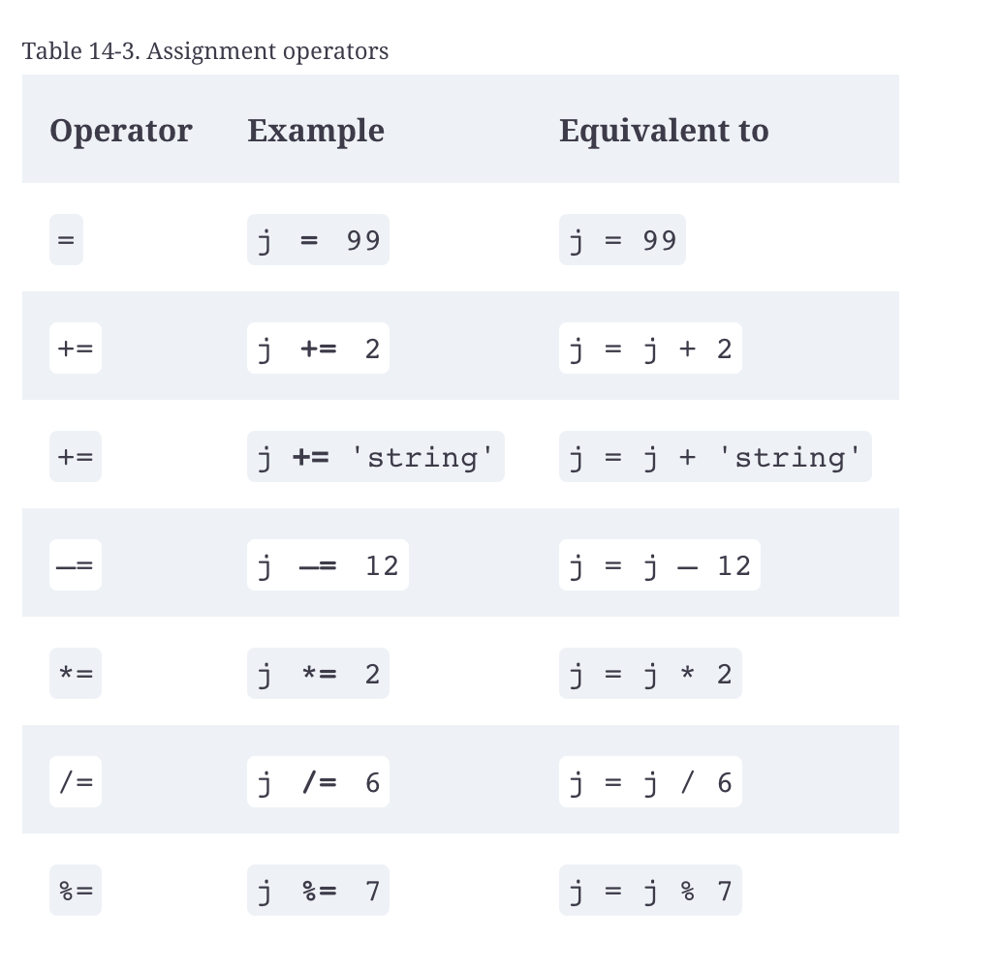
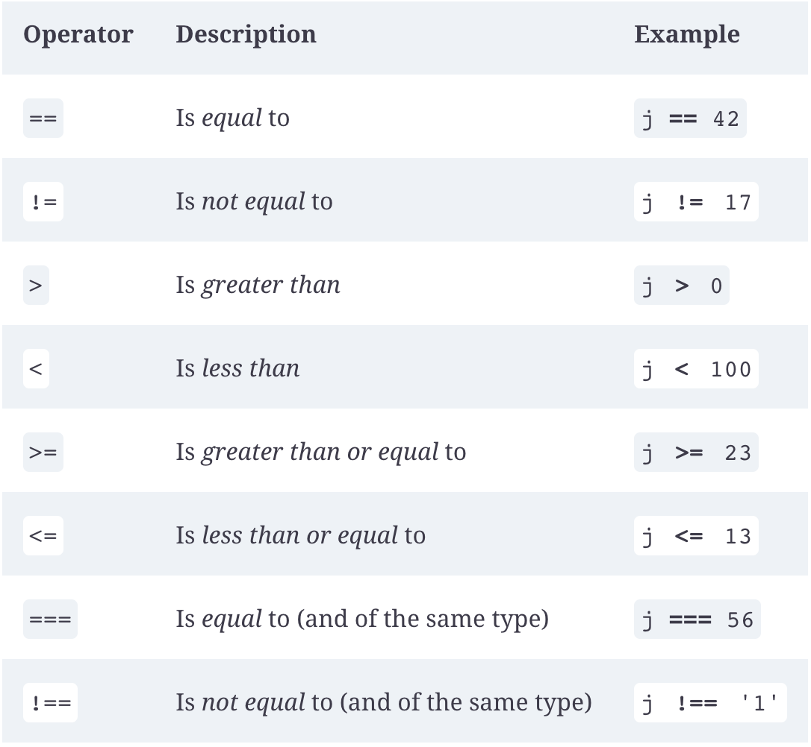

### The Power of JavaScript - Key Points

JavaScript is the primary programming language that allows us to interact directly with HTML. Every time something moves dynamically on a page, or a new element appears, that’s usually JavaScript (although it can be done with some of the CSS tricks we went over last session).

#### Making a script

The simplest way to call a JavaScript script is just to put it directly in the HTML.

We can call a simple function from a button:
`<button onclick=”console.log(‘wassup’)>wassup</button>`

And in the console, if we click the button, we should see it say “wassup”.



We can also call a script directly in the HTML:

```
<body>
  <script>
    console.log(‘i’m in the HTML’);
  </script>
</body>
```

This isn’t generally considered a best practice, though. Especially on HTML pages that are already complicated, it’s nice to keep our JavaScript in a separate file, and try to organize and comment that code as best we can so we (or other people) know what it’s doing.

We can call these external scripts using a script tag too, just using its `src` attribute:

**HTML**:
```
<body>
  <script src=’script.js></script>
</body>
```
**JS:**
```
console.log(‘I’m coming from a script!’)
```

We can also pull a script from an external website, like the p5.js library we used last session:

```
    <script src="https://cdn.jsdelivr.net/npm/p5@1.4.0/lib/p5.js"></script>
```

#### Interacting with the DOM

##### Getting Elements

`document.write()`: writes directly to the page.
```document.write(‘<p>hello!</p>’)```
This is usually best avoided - if we use document.write() after the page has loaded, say on a button click, it’ll overwrite the entire page.

`document.getElementById()`: get an HTML element by its ID.

`document.querySelector()`: get the first element that matches our “query”: this can be a class, type of element, or id

`document.querySelectorAll()`: get all elements that match our query as an array - we’ll touch more on this next week.

##### Changing Elements

Once we get an element, we can change any of its HTML or CSS attributes using just JavaScript!

We can add text, using the `innerText` attribute:

`document.getElementById(‘title’).innerText = ‘JavaScript Rules’`

Or add HTML, using the `innerHTML` attribute:
`document.querySelector(‘.add-html).innerHTML = <strong>I’m adding HTML</strong>`

And we can change any styles we would in CSS, because they’re attributes of the element in JavaScript, just by accessing its `style` property and then the relevant CSS attribute - you can see a full list [here](https://www.w3schools.com/jsref/dom_obj_style.asp):

`document.getElementById(‘title’).style.color = ‘pink’`

Another useful JavaScript trick we can use is getting the value from an HTML input, select, or form:

`document.getElementById(“my-input”).value`

#### DRY Code

One of the fundamental rules of programming is **DRY: Don’t Repeat Yourself**. If you find yourself typing out the same line of code, or the same string or number, over and over, that’s a sign that your code could be better.

Things like variables and functions help us keep our code DRY by, in the case of variables, storing values that we can access later, and in functions, storing blocks of code that we can call again later.

#### Variables

There are three ways to declare variables in JavaScript, `var`, `let`, and `const`. For our purposes, we usually just want to use `let` or `const` - there are some complicated differences you can read more about [here](https://www.freecodecamp.org/news/var-let-and-const-whats-the-difference/):

Let initializes the variable, but also allows you to reassign the variable - you should only use `let` once, when you’re creating the variable itself:
```
  let myColor = ‘green’
  console.log(‘my Color:’, myColor )
  myColor = ‘red’
  console.log(‘my Color:’, myColor)
```

A constant can only be assigned once, and if you try to reassign it you’ll get an error:
```
  const myConstantColor = ‘red’
  console.log(‘my constant: ‘, myConstantColor)
  myConstantColor = ‘green’
```


JavaScript variables can hold multiple types of values - we’ll talk more about arrays and objects next week, but for now we’ll focus on strings `”which are basically words or sentences”` - and integers (numbers without floating points).
##### Side note on string variables

If you declare a string and add extra quotation marks -
`let quote = “he said “what???””`
It’ll throw an error.
You can either make sure your outside marks are either `’` or `”` and your inside marks are the opposite, or you can use “template literals, which start with backticks :
``let quote = `he’s saying “what???”` ``

More on working with strings [here](https://www.digitalocean.com/community/tutorials/how-to-work-with-strings-in-javascript).

#### Functions

Writing a script can allow you to do a lot of things *when that script executes*, but to really add interactivity, and to keep our code DRY, we can use functions to reuse code and do things when users interact with the page.

##### Declaring A Function
You can declare a simple function that does something using this syntax, then `call` it to run the function:
```
  function sayWhassup() {
    console.log(‘whassup’)
  }
  sayWhassup() 
  ```

You can also pass a function a variable as an argument:
```
let word = “what’s good”
function sayWord(word) {
  console.log(word)
}
sayWord(word)
```

And return a value to set a variable:

```
let num = 7

function squareNumber(num) {
  return num*num
}

let numSquared = squareNumber(num)
```

#### Calling Functions To Interact With The DOM

Functions are especially useful for three things:
- Making code reusable (DRY)
- Shortening otherwise long bits of code
- Interacting with the DOM

Some useful functions for shortening longer bits of code are in the utility.js file, for example the `O(‘element’)` function, which allows us not to type `document.getElementById(element)` every time we want to access one:
```
function O(i)
{
  return typeof i == 'object' ? i : document.getElementById(i)
}
```

So, for example, we could change the text of an element without writing as much:

```
  let newText = ‘lorem ipsum dolor sit amet’
  function changeText(element) {
      S(element).innerText  = newText
  }
```


Or the `S(element function)`, which allows us to directly access an element’s style:

```
function S(i)
{
  return O(i).style
}
```

So, for example, we could write a function that changes the color of an element much easier:

```
  let divChangeColor = ‘blue’
  function changeColor(element) {
      S(element).backgroundColor = color
  }
```

To call these scripts on user interaction, we can either call them from an HTML button click or a JavaScript `.onclick` listener. Calling from a button click will only work when we’re passing our function an argument that it can get from the HTML, or no arguments at all:

**JS**:
```
function sayWord(word) {
  console.log(word)
}
```


**HTML**:
```
<button onclick=”sayWord(‘yoooo’)”>
```

So for our `changeColor()` function, which relies on us **getting an element** to pass as an argument, we have to use an onclick function:

**JS**:
```
  let divChangeColor = ‘blue’
  function changeColor(element) {
      S(element).backgroundColor = color
  }

  let changeDiv = O(‘change-me’)

  changeDiv.onclick = function()
 {
  changeColor(changeDiv)
 }
```
**HTML**:
```
<div id=”change-me”>click me to change color</div>
```

We can also use these techniques to get values from an input and change the DOM:


**HTML**
```
<input type=”text” id=”add-text”><button onClick=”addHTML()”><p id=”text-container”></p>
```
**JS**
```
  function addText() {
    let textInput = O(‘add-text’)
    // if we get the value after we get the variable, we can reset the input to blank
    let text = textInput.value
    let textContainer = O(‘text-container’)
    textContainer.innerText += ‘<p>’ + text + ‘</p>’
    // clear the input
    textInput.value = ‘’
  }
```

##### Side note - Global and local scope

One other thing to note is that JavaScript variables behave differently inside and outside of functions. If we declare a variable outside of a function, it’s a “global” variable, and everything in our script has access to it. If we declare it inside a function, only the function has access to it. It’s important not to redeclare a global variable inside a function if that function is supposed to be using or changing it!

```
let myGlobalVariable = ‘hello’
function logGlobalVariable() {
  console.log(‘global variable inside the function: ’, myGlobalVariable)
}
console.log(‘global variable  outside the function: ‘, myGlobalVariable())

function redeclareGlobalVariable() {
  let myGlobalVariable = ‘goodbye’
  console.log(‘global variable inside the function:’ , myGlobalVariable)
}
console.log(‘global variable outside the function: ‘, myGlobalVariable)
```

#### Operators and Outputs

- `=`: sets a variable equal to something - we can set our global total variable to 0 for now: `let total = 0`
- `+=`: adds to a variable - so in our adding function, we can add to our total - we can use `total = total + value`, or the shorthand, `+=`
- `-=`: subtracts from a variable
- `*=`: multiplies a variable
- `/=`: divides a variable

There’s also the [modulus operator](https://developer.mozilla.org/en-US/docs/Web/JavaScript/Reference/Operators/Remainder), which you shouldn’t have much reason to use:
- `%=`: This gives us the remainder when one variable is divided by another: `12 % 5` would equal 7



We can also add numbers to strings and vice versa, but this can get pretty weird: 

```
let n = “123`
n*=1
```

```
n = 123
n+= “”
```

JavaScript has some built-in functions that make dealing with numbers that should be strings and vice versa easier:

```
let n = “123”
n = parseInt(n) // this will convert N into an integer or whole number - 123
n = parseFloat(n) // this will convert N into a floating point number - 123.0000
n = Number(n) // this tries to parse the whole string, which can lead to problems
```


You can also turn a number into a string like so:

```
let n = 123
n = parseString(“123”)
```

You’ll notice we’re using `parseInt` in the media player example - even though our input element is designated as a number, it still comes out as a string in the JavaScript!

More on number conversion [here](https://thisthat.dev/number-constructor-vs-parse-int/).


### Conditionals and Control Flow

Conditionals `if/else` and `switch` statements allow us to execute different blocks of code based on whether a condition is met.



If statements look to evaluate if the “statement” being evaluated is true - in this case, if the variable `name` is equal to “Brent” - an obviously true statement.
```
let name = ‘Brent’
  if (name == ‘Brent’) {
    console.log(‘You’re a professor’)
  }
```

and add an else to make another one:
```
  if (name == ‘Brent’) {
    console.log(‘You’re a professor’)
  } else {
    console.log(‘You’re a student’)
  }
```

We can also make an else if statement based on a value, and use comparison operators to make our code behave differently:

```
  let num = 5
  // if number is greater than or equal to 2
  if (num >= 2) {
    console.log("Big number, huh?’)
  } else if (num > 0) {i
    console.log(‘Guess you’re into smaller numbers’)
  } else {
    console.log(‘Glass half empty, huh?’)
  }
```

Or use a switch case, which takes a variable and behaves differently based on what its value is:
```
let num = 2
switch (num) {
    case 1:
      console.log("that’s strike 1")
      break; /* this ends execution for this case - 
      if other cases are true and you don't include a break statement, 
      they can get executed too*/
    case 2:
      console.log("that’s strike 2")
      break;
    default:
      console.log(“that’s strike three!”)
      break; // if there’s a chance the variable won’t meet any of your cases, the default case will execute
  }
```

Finally, we can use logical operators in case we want to see if two things are true (`&&`), either of two things are true (`||`), or something isn’t the case (`!=`):


```
if (name == “Brent” && num == 3) {
  console.log(name + “‘s favorite number is + num)
}

```


