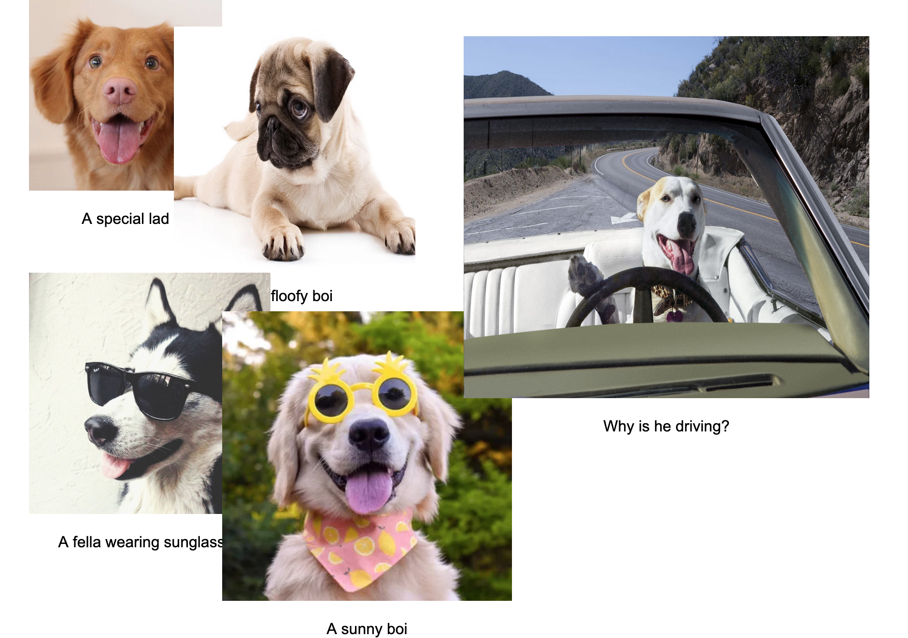

- [Notes for today](notes.md)

## Reference

- [All HTML Color Names](https://www.w3schools.com/colors/colors_groups.asp)
- [Array methods cheat sheet](https://dev.to/vincenius/javascript-array-functions-cheatsheet-1c15)
- [Object methods cheat sheet](https://dev.to/vincenius/javascript-object-functions-cheat-sheet-48nn)
- [For...in vs. For.. of](https://bitsofco.de/for-in-vs-for-of/)
- [JavaScript Arrow Notation](https://www.w3schools.com/js/js_arrow_function.asp)
- [Document.createElement](https://developer.mozilla.org/en-US/docs/Web/API/Document/createElement)
- [JSON Syntax](https://www.w3schools.com/js/js_json_syntax.asp)

## Reading
- [Arrays](https://developer.mozilla.org/en-US/docs/Learn/JavaScript/First_steps/Arrays)
- [Looping code](https://developer.mozilla.org/en-US/docs/Learn/JavaScript/Building_blocks/Looping_code)
- [Objects](https://developer.mozilla.org/en-US/docs/Learn/JavaScript/Objects/Basics)

#### - [Array Tutorial Code](https://drive.google.com/file/d/1Uz9yEQ4qu2dWLvjE89JmPZB3u4aoZc3y/view?usp=sharing)
#### - - [Object Tutorial Code](https://drive.google.com/file/d/1VzxZr287JGMmZ4B_bF3fj0t64gWa1rNw/view?usp=sharing)

## Assignment - [Starter Code](https://drive.google.com/file/d/1Ogj5CTEg5Ha4EEQuG7NaijXLV35h9dck/view?usp=sharing)

### Option 1: Object Story (assignment_story in the [starter code](https://drive.google.com/file/d/1Ogj5CTEg5Ha4EEQuG7NaijXLV35h9dck/view?usp=sharing))
- Using the starter code, create your own array of at least 5 objects each that writes a short story
- (Or whatever you’d like - you could write a series of recipes, or a poem, or a list of complaints, or mad libs)
- Each object should have least **four** key/value pairs, like - `[{noun: ‘dog’, adjective: ‘brown’, verb: ‘ran’, adverb: ‘quickly’}]` - come up with your own keys and values
- Use a for loop over the array in the `showElements()` function to add your keys and values to the container
- In the HTML, add an input for your extra keys so you can add to your array
- Update the addItems() function to add your extra keys
- Feel free to add your own CSS styles
- Bonus points: use an array as a key value and iterate over that; use the getRandomItem() function to make it randomized; use a querySelector() to add an onclick function or change the HTML

### Option 2: Image Collage (assignment_img in the [starter code](https://drive.google.com/file/d/1Ogj5CTEg5Ha4EEQuG7NaijXLV35h9dck/view?usp=sharing))
- Using the starter code, create your own array of at least 5 objects with image sources and attributes
- In the `addImage()` function, add a for loop that adds them to the page using the `createDiv()` function
- They’re already absolutely positioned, so set position attributes for them in the object keys and apply them in the `createDiv()` function - like the “top” and “left” in the starter code
- Make an image collage using the positioning in each object
- Add at least one key/value pair to each object that styles either the `
` or the `` in the `createDiv()` function (like the width and height or top and left in the starter code)
- You can also add captions or other elements from your object - go wild!
- Feel free to add your own CSS styles as well
- Bonus points: use a querySelector to add an onclick function to them; add a button that changes their HTML or order

(One possible outcome from your collage)

## Either Option

- In your web production 2 folder, create a folder called `week5`
- Put your finished code in the `week5` folder and commit and push to GitHub
- Check and make sure it uploaded to your GitHub page - it should be at {your github username}.github.io/week5/
- Submit the link [here](https://docs.google.com/forms/d/e/1FAIpQLScJ_hzjToD08UX5Py2QP4t8VhiKaIAHZNn6dQVUQbSerfHgrA/viewform?usp=sf_link)

