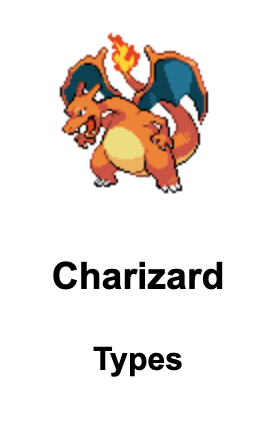
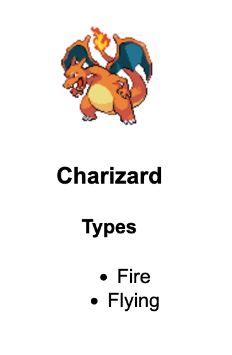
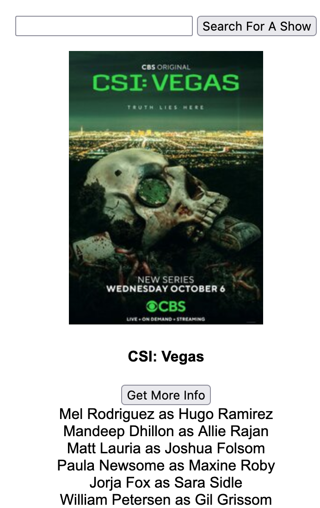
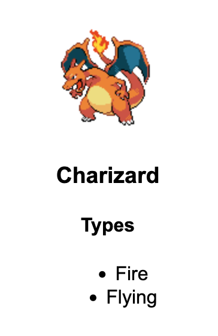

## Tips and Tricks For The Midterm


### Easy Mode: Populating Pre-Written HTML

To go along with the PokeAPI tutorial code:

The easiest way to populate your page and set up interaction is to pre-write your HTML and just append to it or set its attributes. This way, if you want to add click handlers or any other events, the HTML they’re attached to will **already be there**.


Let’s say we have some pre-written HTML like this:
```
<div id="pokemon">
    
    <h3 id="name" class="capitalize"></h3>
    <h4>Types</h4>
    <ul id="type">
    </ul>
</div>
```

We can fill out its data with this request, and by default populate the HTML we’ve already written:

```
function getPokemon(pokemonName) {
  $.getJSON(`https://pokeapi.co/api/v2/pokemon/${pokemonName}`, function(data) {
    console.log('data: ', data)
    $("#pokemon-img").attr({src: data.sprites.front_default})
    $("#name").text(data.name)
    for (let object of data.types) {
      $("#type").append(`<li class=" capitalize">${object.type.name}</li>`)
    }
  }).fail(function() {
    console.log("We couldn't find that pokemon")
  })
}
```

Let’s say our list of types are hidden, so all we can see is this:



Since the type HTML was already on the page, all we have to do is add a click handler in our main code with the `document.ready` shorthand:

```
$(function() {
  getPokemon(‘charizard’)
  $(“#pokemon”).click(function() {
    $(“#types).show()
  })
})
```

And we can get this:




### Hard Mode: Making Multiple Requests

Some of the APIs you’re using have multiple endpoints that give different data. This is easy enough to work with if they’re all simple, or just take different API queries, but what if some of them require an ID?

To use these APIs, like the [TVMaze Shows API](https://www.tvmaze.com/api#shows), we have to get the ID first, then make a **second API request** using that ID **inside our first API request**. To keep our code DRY, it’s best to do this by making different functions for each action or API call.

In our document.ready code, we just have a show search function:
```
$(function() {
    $("#show-search").click(function() {
      let showName = $("#show-name").val()
      if (showName != '') {
        getShow(showName)
      }
      //reset the input
    $('#show-name').val('')
  })
 })
 ```

 Which, using the function `getShow()`, makes a call to the TVMaze search API to get any shows that match our search:

```
function getShow(showName) {
  $.getJSON(`https://api.tvmaze.com/search/shows?q=${showName}`, function(data) {
    console.log('data: ', data)
    //just getting 4 shows but we could use data.length to get all of them
    for (let i =  0 ; i < 4; i++) {
      // add some show data
      let show = data[i].show
      let showDiv = $(`<div class="show"> <h4>${ show.name}</h4></div>`)
      let infoButton = $(`<button class="get-info">Get More Info</button>`)
      //append it to the container
      $('#show-container').append(showDiv)
      $("#show-container").append(infoButton)
      //now we add a function that, on a button click, makes a second API request using the ID from our first request.
      getInfo(infoButton, show.id)
    }
  }).fail(function() {
      console.log("that request failed")
  })
}
```

This adds our show data and a button to the page to “get more info”, but then attaches a new API request **using the show ID** to that button. (It also attaches a click handler to **created** HTML, which is explained a bit more in the next section). This allows us to, on the button click, make a request to a separate API endpoint in the `getInfo()` function. So let’s say we wanted to use the `https://api.tvmaze.com/shows/${show_id}/cast` endpoint. We can run our `getInfo()` function using that endpoint, and loop over the results to show the cast:


```
function getInfo(element, showId) {
  element.click(function() {
    $.getJSON(`https://api.tvmaze.com/shows/${showId}/cast`, function(data) {
      console.log('data', data)
      for (let actor of data) {
        element.after(`<div>${actor.person.name} as ${actor.character.name}`)
      }
    })
  })
}
```

So, if I search for “csi”, we’re able to get something like this:




### Hard Mode: Populating Your Own HTML

If we want to populate the page with our own HTML, dynamically, we have to bind any events **in the request itself**, because a simple jQuery click handler like the one above will run **before the HTML is on the page** and not work.

Let’s take a look at the jQuery exercise in today’s starter code, which is already set up to do this (and uses multiple API requests!)

```
function getAllPokemon() {
  $.getJSON(`https://pokeapi.co/api/v2/pokemon/`, function(data) {
    console.log('data:', data)
    let done = false
    for (let i=0; i < 100; i++) {
      getPokemon(data.results[i].name)
    }

  }).fail(function() {
    console.log("We couldn't find that pokemon")
  })
}
```

This calls our `getPokemon()` function, which **dynamically** populates the page with pokemon:
```
function getPokemon(pokemonName) {
  $.getJSON(`https://pokeapi.co/api/v2/pokemon/${pokemonName}`, function(data) {
    console.log('data: ', data)
    let pokemonDiv = $(`<div class="pokemon"><h3 class="capitalize">${data.name}</h3>"`)
    let types = $("<ul class='types'><h4> Types</h4></ul>")
    for (let object of data.types) {
      $(types).append(`<li class="capitalize">${object.type.name}</li>`)
    }
    let abilities = $("<ul class='abilities'><h4>Abilities</h4></ul>")
    for (let object of data.abilities) {
      $(abilities).append(`<li class="capitalize">${object.ability.name}</li>`)
    }

    pokemonDiv.append(types)
    pokemonDiv.append(abilities)
    $("#pokemon-container").append(pokemonDiv)
    attachEvents(pokemonDiv)
  }).fail(function() {
    console.log("We couldn't find that pokemon")
  })
}
```


But the most important thing here, since we’re **creating** our own HTML and appending it to `#pokemon-container`, is the `attachEvents()` function: this takes an element that we’ve created, and attaches an event handler to it - in this case a hover function. By running this on each new element as it’s created, we make sure that the jQuery is attached to the new element.

```
function attachEvents(element) {
  element.hover(function() {
      $(this).find('.types').show()
  },
    function() {
      $(this).find('.types').hide()
    }
  )
}
```

We can then run all this code in our normal jQuery loop:

```
$(function() {
  getAllPokemon()
})
```

And get a Pokedex that shows the Pokemon types on hover!



