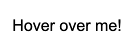
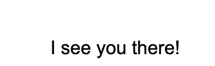
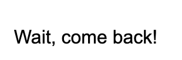

## Advanced jQuery

jQuery has a number of built-in functions for interacting with the page in more interesting ways.

### Keypress

For starters, if you want to interact with an object on keypress, you can use $(document).keypress:

```
$(document).keypress(function(event)
    {
      key = String.fromCharCode(event.which)

      if (key >= 'a' && key <= 'z' ||
          key >= 'A' && key <= 'Z' ||
          key >= '0' && key <= '9')
      {
        console.log(‘key’)
        event.preventDefault()
      }
})
```

This gets you the key that was pressed, and the if statement checks to see if it was an alphabetic or numeric key.

You’ll notice the `event.preventDefault()` in there - all jQuery events, like `click` and the others we’ll cover today, have an optional event parameter. If we call `event.preventDefault()`, it’ll stop whatever the default action of that event is - in the case of keypress, this might intercept it before you could type in a form.

[More on event.preventDefault()](https://www.w3schools.com/jquery/event_preventdefault.asp)

In the `keypress` example, we’ll use this in a switch statement to move the pokemon around:
```
let pokemonImg = $("#pokemon")
  $(document).keypress(function(event)
    {
      key = String.fromCharCode(event.which)

      if (key >= 'a' && key <= 'z' ||
          key >= 'A' && key <= 'Z' ||
          key >= '0' && key <= '9')
      {
        $('#key-result').html('You pressed: ' + key)
        event.preventDefault()
      }
    switch (key) {
      case 'w':
        pokemonImg.css({'top': '-=1'})
        break;
      case 'a':
        pokemonImg.css({'left': '-=1'})
        break;
      case 's':
        pokemonImg.css({'top': '+=1'})
        break;
      case 'd':
        pokemonImg.css({'left': '+=1'})
        break;
    }
  })
```

Which allows us to move the Pokemon around the page using the WASD keys.

You’ll also notice these are using relative values: you can pass jQuery css and animation functions a relative value, like `+=1` or `-=1`, rather than absolute values, if you want to change stuff slowly.

### MouseMove/MouseEnter/Hover

Let’s say we have some HTML like so:

```
<div> <p id="mouse-test">Hover over me!</p></div>
```




jQuery has built-in `mouseenter()` and `mouseleave()` functions, so we can detect when the mouse is over a certain element.

Let’s try changing the HTML by mousing over it:

```
$('#mouse-test').mouseenter(function() {
  $(this).html('I see you there!')
})
```
Which should give us this when we mouse over it:



Then we can change it again when our mouse leaves:

```
$('#mouse-test').mouseleave(function() {
  $(this).html('Wait, come back!')
} )
```

Which gives us this:




But we can also use the `hover()` function, which takes two functions as an argument, to get the same result - the first function will fire when the mouse enters the element, and the second will fire when the mouse leaves it:

```
$('#mouse-test').hover(
  function() { 
    $(this).html('I see you there!')
  },
 function() { 
     $(this).html('Wait, come back!') 
 }
)

```

### Mouse Position

We can also use the `$(document).mousemove()` function to detect mouse position and move stuff around the page - for a demo of this, check the mousemove folder in the tutorial code:

```
$(document).mousemove(function(e){
  let mouseX = e.pageX
  let mouseY = e.pageY
  console.log('mouseX: ', mouseX)
  console.log('mouseY: ', mouseY)
})
```

This uses the `e` or event parameter of the mousemove event (like `event.preventDefault`) to get mouse position. You could use this to move an element around with the mouse (you can see this in the mousemove tutorial code), or creepy tracking like [clickclickclick](https://clickclickclick.click).

### Built-In Animations

jQuery has a number of built-in animations for showing and hiding - all of these are in the animations tutorial code:

- `$(“#element”).show()` - shows a hidden element
- `$(“#element”).hide()` - hides a visible element
- `$(“#element”).fadeIn()` - fades a hidden element into visibility
- `$(“#element”).fadeOut()` - fades a visible element out of visibility
- `$(“#element”).fadeToggle()` - toggles a fade on whether an element is visibile or not
- `(“#element”).slideUp()` - slides an element up out of visibility
- `$(“#element”).slideDown()` - slides a hidden element down out of visibility
`$(“#element”).slideToggle()` - toggles sliding an element up and down

Each of these can take a number, for the milliseconds it’ll take (e.g. `500` for half a second), or a built-in speed parameter: “slow” or “fast”.

You can also fade the opacity of an element with `fadeTo`, which can take either milliseconds or speed and a second argument, the opacity value you want it to fade to:

`$(“#element”).fadeTo(“slow”, 0.5)`


### Custom Animations
[More on Animation](https://www.w3schools.com/jquery/jquery_animate.asp)

You can also make your own custom animations, which take arguments like the `.css()` function, except for color.

```
$(“#button”).click(function() {
  $(“#button”).animate({
    height: ‘100px’
  })
})
```


You can also pass the function a time, like the built-in functions:

```
$(“#button”).click(function() {
  $(“#button”).animate({
    height: ‘50px’
  }, ‘slow’)
})
```

Finally, you can add a [callback function](https://www.w3schools.com/jquery/jquery_callback.asp) to do something else once the animation finishes:

```
$(“#button”).click(function() {
  $(“#button”).animate({
    height: ‘50px’
  }, ‘slow’, function() {
    $(“#button”).text(‘animation finished’)
  })
})
```

