# Class 8: Introduction to Node.js, Midterm Work Session & One-On-Ones

## Getting Set Up With Node & Heroku

These instructions are mostly geared towards Macs or Linux systems, but I’ve included some basic commands for using Windows since I know a number of you are on Windows computers. If you’re having trouble with anything on Windows, you can check out these references for using the command prompt:

- [Beginner’s Guide To Windows Command Prompt](https://www.makeuseof.com/tag/a-beginners-guide-to-the-windows-command-line/)
- [Windows Command Prompt Cheat Sheet](https://serverspace.us/support/help/windows-cmd-commands-cheat-sheet/)

### Downloads and Installs

**On Mac**

1. Open the terminal. 

    - On a Mac, hit CMD + Space and search `terminal`, then hit enter to open it. You should see a window like this (your colors and settings may be somewhat different):

2. Make sure you have git installed: run `git --version` in the terminal, and if it’s not installed, you should get a prompt to install it.

    - If it’s installed you should see a version number like this:

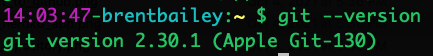

3. [Download Node.js and NPM](https://nodejs.org/en/).

4. Download the [Heroku CLI](https://devcenter.heroku.com/articles/heroku-cli#download-and-install): you can just enter `brew tap heroku/brew && brew install heroku` in the Terminal.

5. Go to [Heroku](https://www.heroku.com/), hit "Sign up", and go through the process.

**On Windows**

1. Open Command Prompt.

    - Hit the windows button and search for Command Prompt. Open it, and you should see a window like this.

2.  Make sure Git is installed.
    - Type `git version` in the terminal.
It should give you a version number like the one below. If It’s not installed, you can download it [here](https://gitforwindows.org/). Follow [these instructions](https://www.computerhope.com/issues/ch001927.htm) to get it installed properly.

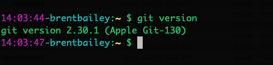

3. [Download Node.js and NPM](https://nodejs.org/en/).

    - Use the “Recommended For Most Users” version and follow the instructions - check the “automatically install the necessary tools” box when it pops up. After this, you should see a Powershell window pop up - hit any key to continue when it pops up and let it keep running until it’s done.

4. Download the [Heroku CLI](https://devcenter.heroku.com/articles/heroku-cli#download-and-install) 
    - Use the installer at the link above. If you get a warning saying “Windows protected your PC”, hit “more info”, verify “salesforce.com, inc” as the publisher, then click the “Run Anyway” button.

5. Go to [Heroku](https://www.heroku.com/), hit "Sign up", and go through the process.

Give me a thumbs up when you’re finished installing everything, and I’ll do the next steps along with you.

### Creating Our App

We’ll be using the terminal more often from here on out, so some basic commands to get used to:

`cd`: change directory - enter a folder  
`mkdir {directory name}`: make a new folder  
`touch {file name}`: make a new file  
`ls`: list all files in the current folder  
`mv {folder or file name} {folder or file}`: move a folder or file to a different location

Some of these are slightly different on Windows, because Microsoft is annoying - you can see more about the command prompt [here](https://www.makeuseof.com/tag/a-beginners-guide-to-the-windows-command-line/).

1. Download the [starter code](https://drive.google.com/file/d/11HWLLPDbLovqQc8vaj3308K0nc911GtC/view?usp=sharing) and put it in your folder of choice 
    - Usually this should be Documents, but if you have a different place you’d like to keep it feel free to put it there.
    - If you want to do this in the terminal, you can just move it there using `mv` - on Mac, this is:
    - `mv ~/Downloads/web-production-2-server Documents/`

2. Navigate to the directory in the Terminal

    - In the terminal, enter `cd Documents/web-production-2-server` (or replace documents with whatever folder you put the starter code in)

    - To make sure you’re in the right folder (you should get an error message if you try to go to one that doesn’t exist, but to double check):

      **Mac**: enter `ls`

      **Windows**: enter `dir`

      You should see an output like this - these commands list all the files in the folder you’re in:

3. Install Our Packages
    - Make sure you’re in the starter code folder in the terminal.
    - Run `npm install`. 
        Since I’ve provided a `package.json` file, it knows to install all the packages in there already. We're installing all the packages we'll need to get started:

      **Express** : Allows us to run a simple server.

      **Handlebars**: Allows our server to serve our files easily, and use templates to make repeatable templates for our pages.

### Running The Server

Once our server is set up, all we have to do in the terminal is enter:

`node app.js`

And our server will be running locally - if you go to `localhost:3000` in the browser, you should see this:

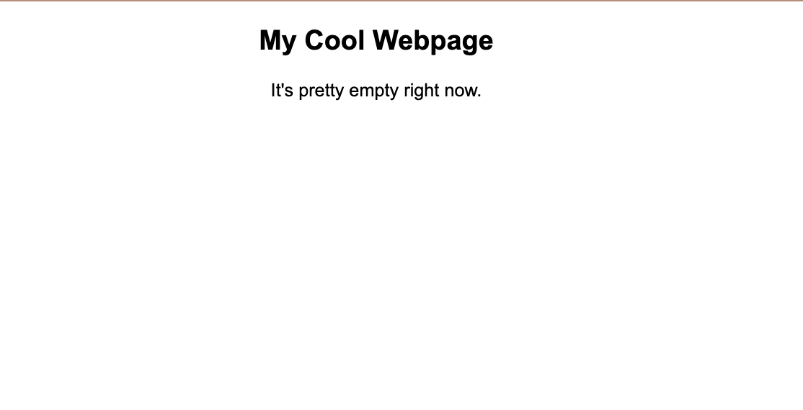

### Adding to Git 

1. Open the app’s folder in Atom.

2. Go to the Git pane in Atom and hit "Create Repository".

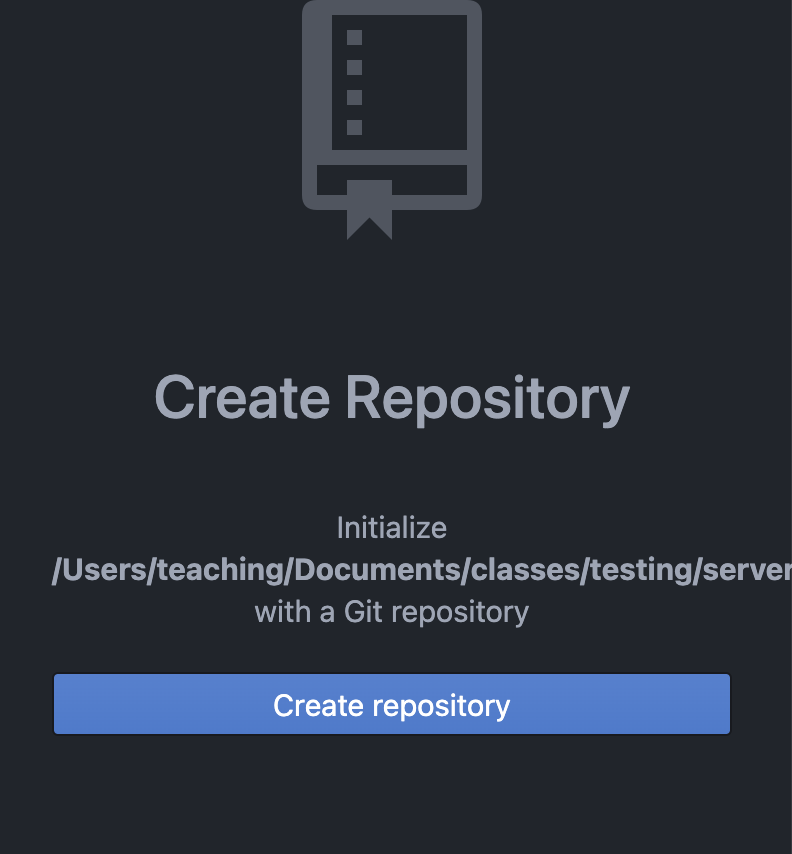

3. Stage and commit

    - You should be familiar with the process of adding and committing your changes by now, but if you've forgotten, hit "Stage All", add a commit message, and hit "Create detached commit"

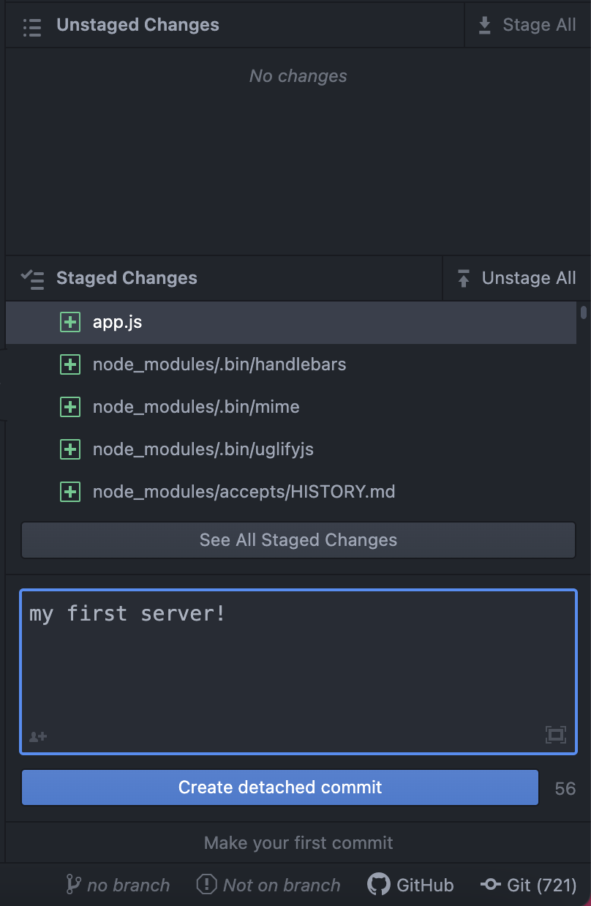

4. Publish to a new GitHub repo

    - Then go to the GitHub pane and hit "Publish on Github" - you can call it whatever you want, but this is where all your server code will live from now on.

## Setting Up Heroku

Try following the rest of the instructions in the terminal, but if you’re having trouble there are instructions for setting it up using the browser below.

1. Log in to Heroku
    - Once the Heroku CLI has downloaded, in the terminal:
    - Enter `heroku login`
    - Hit any key to go to the browser and log in. 

2. Create a Heroku App

    - Back in the Terminal:
    - Enter `heroku create {your-name}-web-production-2-server`
        This creates a Heroku instance for your server.

3. Push your app to Heroku
    - Enter `git push heroku main` (or `git push heroku master` if that’s the branch you’re on - you can check in the terminal by typing `git branch`) to push to Heroku - make sure you’ve added and committed to your repository already.

4. Open the App!

    - Enter `heroku open` to open the page in the browser.

If all went well, you should see your local site hosted on Heroku!

## In The Browser

If you’re having lots of trouble with the terminal, you can also get this set up in the browser: go to your dashboard on heroku and  hit “New” to create a new app:

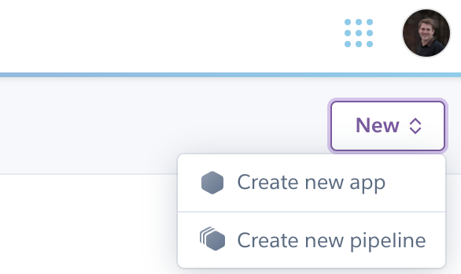

call it `{your-name}-web-production-2-server` and hit "Create App" -

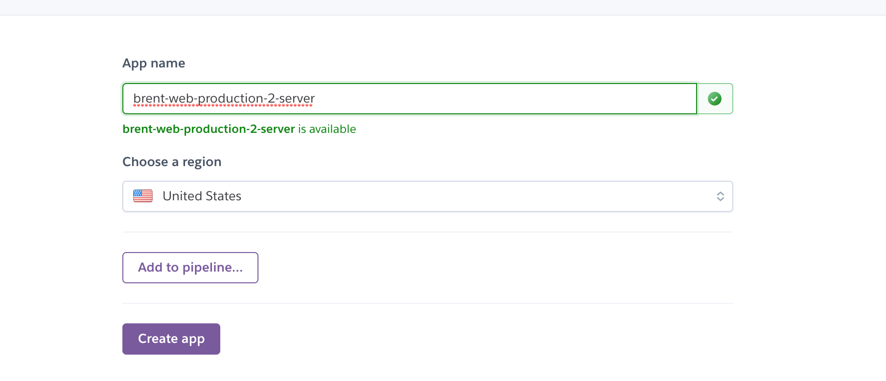

Once it's created, go to the "Deploy" tab and hit "Connect to GitHub", then scroll down and hit the "Connect to Github" purple button:

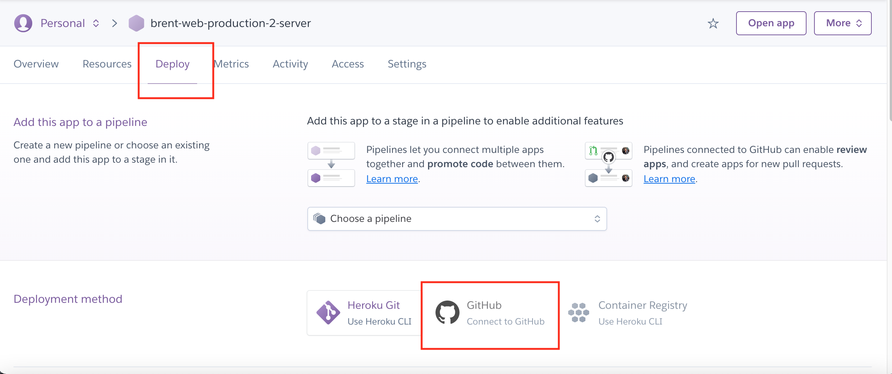

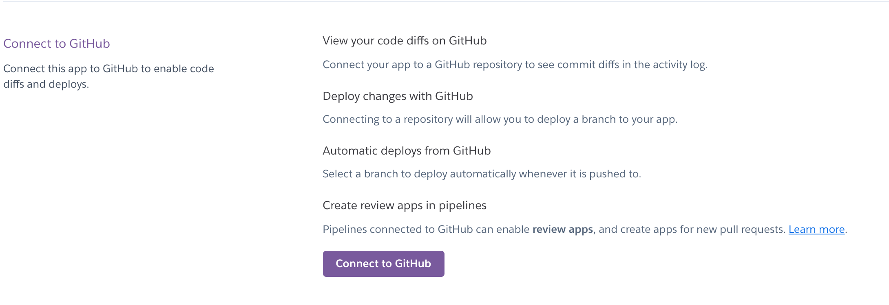

Hit "Authorize Heroku", then in "Connect to Github" enter the repository name:

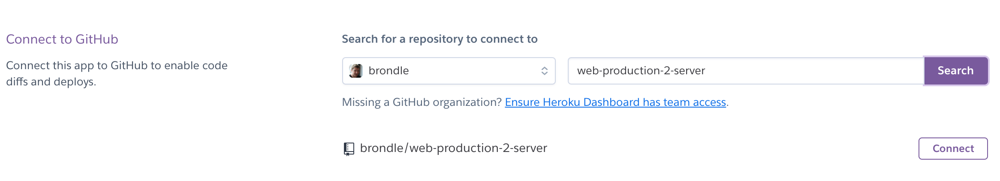

From here, it's probably easiest if you enable Automatic Deploys, which will update the app on Heroku every time you push to GitHub, but you can also scroll down to manually deploy:

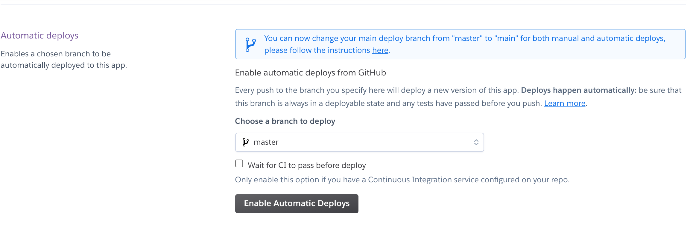.

## Reference
- [Static vs. Dynamic Websites](https://www.zesty.io/mindshare/marketing-technology/dynamic-vs-static-websites/)
- [What Is Localhost?](https://www.hostinger.com/tutorials/what-is-localhost)
- [What Is Web Hosting?](https://www.techradar.com/news/what-is-web-hosting-and-why-do-you-need-it)
- [Command Line Crash Course](https://developer.mozilla.org/en-US/docs/Learn/Tools_and_testing/Understanding_client-side_tools/Command_line)
- [Command Line Cheat Sheet](https://www.git-tower.com/blog/command-line-cheat-sheet/)
- [Beginner’s Guide To Windows Command Prompt](https://www.makeuseof.com/tag/a-beginners-guide-to-the-windows-command-line/)
- [Windows Command Prompt Cheat Sheet](https://serverspace.us/support/help/windows-cmd-commands-cheat-sheet/)
- [Git Cheat Sheet](https://www.google.com/url?sa=t&rct=j&q=&esrc=s&source=web&cd=&ved=2ahUKEwjQhez78tTzAhXoYN8KHfyqD_EQFnoECAMQAQ&url=https%3A%2F%2Feducation.github.com%2Fgit-cheat-sheet-education.pdf&usg=AOvVaw2D3W2R0fwoOBi8YrhZYLFJ)
- [Git Handbook](https://guides.github.com/introduction/git-handbook/)
- [The Heroku CLI](https://devcenter.heroku.com/articles/heroku-cli#download-and-install)
- [Getting started on Heroku with Node.js](https://devcenter.heroku.com/articles/getting-started-with-nodejs)
- [Introduction to Node.js](https://nodejs.dev/learn)
- [Express.js](https://expressjs.com/)
- [Express/Node introduction](https://developer.mozilla.org/en-US/docshttps://javascript.plainenglish.io/10-useful-npm-packages-you-should-be-aware-of-d72cab2a38f1/Learn/Server-side/Express_Nodejs/Introduction)
- [Node for beginners](https://github.com/rockbot/node-for-beginners)
- [Introduction to NPM](https://nodejs.dev/learn/an-introduction-to-the-npm-package-manager)
- [Building Multiplayer Games with Node.js and Socket.io](https://modernweb.com/building-multiplayer-games-node-js-socket-io/)
- [Writing a Multiplayer Text Adventure With Node.js](https://www.smashingmagazine.com/2019/10/multiplayer-text-adventure-engine-node-js-part-2/)
- [How to build a multiplayer browser game](https://hackernoon.com/how-to-build-a-multiplayer-browser-game-4a793818c29b)
- [Fun And Games With Node.js](https://medium.com/the-node-js-collection/fun-and-games-with-node-js-359cee687173)
- [Build a Portfolio website With Node JS & Express](https://www.udemy.com/course/portfolio-website-with-node-js-express/)

## Inspiration
- [10 useful NPM packages](https://javascript.plainenglish.io/10-useful-npm-packages-you-should-be-aware-of-d72cab2a38f1)
- [10 Funny JavaScript Libraries](https://brainhub.eu/library/funny-javascript-libraries/)
- [Google I/O Adventure](https://arstechnica.com/gadgets/2021/05/googles-i-o-adventure-was-almost-as-good-as-being-there/)

